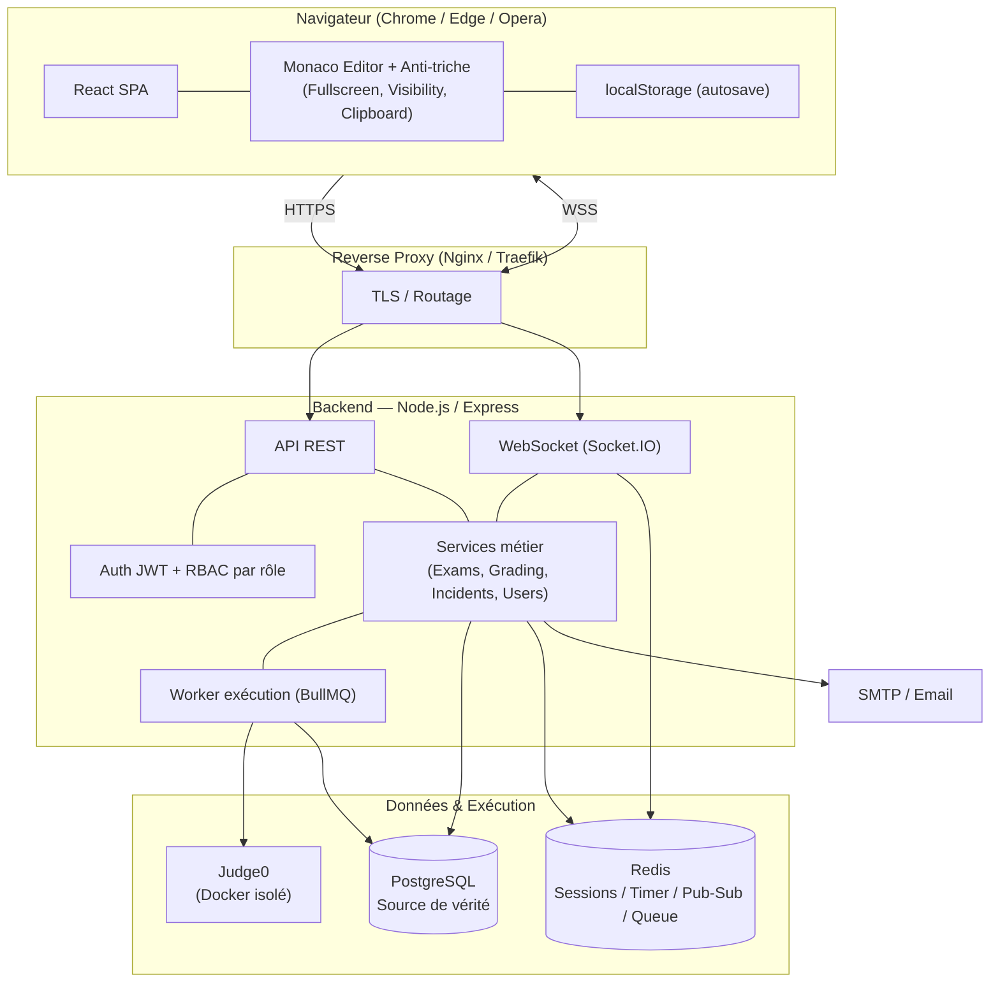
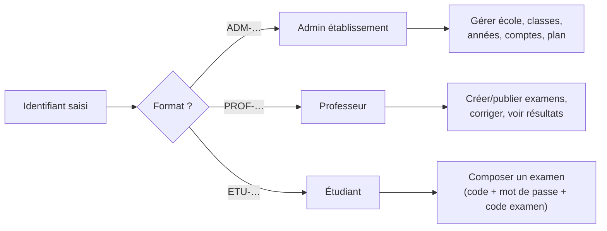
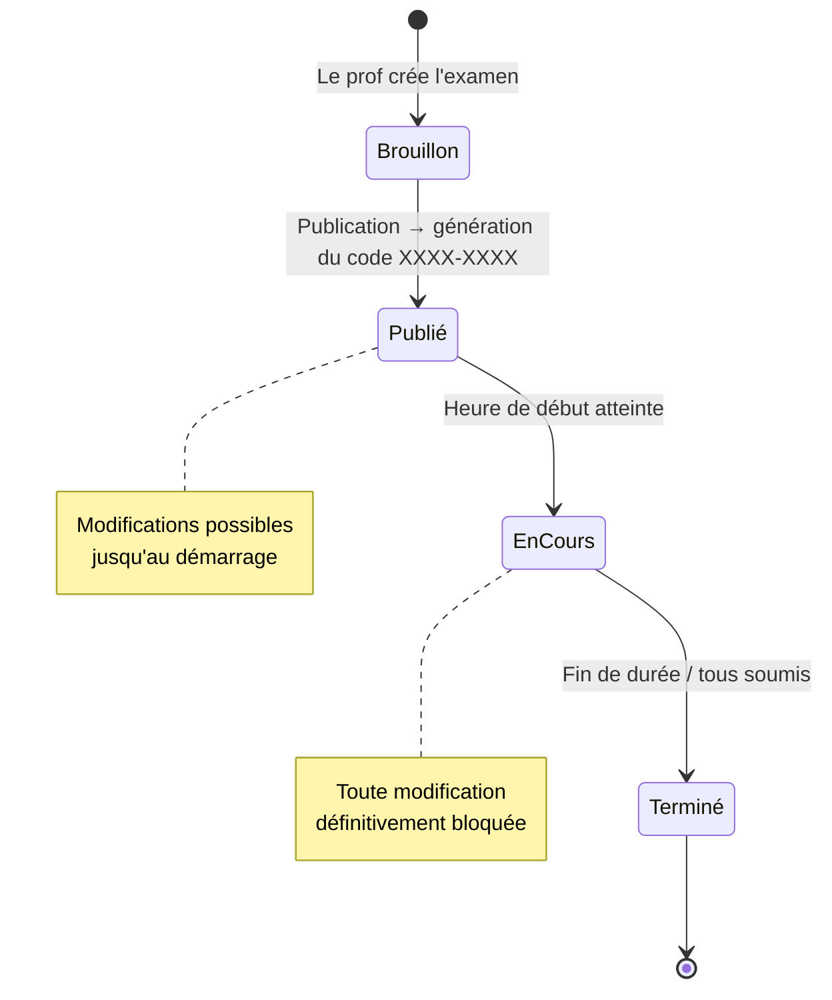
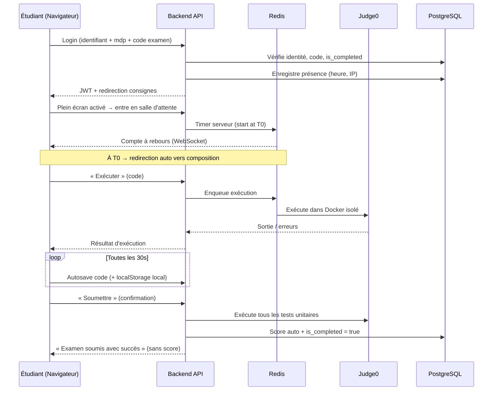
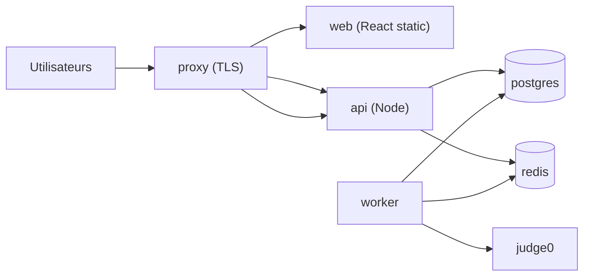

# Cylentic — Architecture du système

> Plateforme d'examens de programmation en navigateur sécurisé (anti-triche),
> avec IDE intégré, exécution de code en sandbox et correction automatique.
>
> Ce document décrit l'architecture **MVP** : minimale et fonctionnelle aujourd'hui,
> conçue pour être extensible demain (multi-langages, QCM avancé, facturation, API publique).

---

## Sommaire

1. [Principes directeurs](#1-principes-directeurs)
2. [Vue d'ensemble du système](#2-vue-densemble-du-système)
3. [Stack technique](#3-stack-technique)
4. [Diagramme d'architecture général](#4-diagramme-darchitecture-général)
5. [Modèle multi-tenant et sécurité](#5-modèle-multi-tenant-et-sécurité)
6. [Découpage du backend (API)](#6-découpage-du-backend-api)
7. [Flux critiques](#7-flux-critiques)
8. [Le sandbox d'exécution (Judge0)](#8-le-sandbox-dexécution-judge0)
9. [Temps réel et timer serveur (Redis)](#9-temps-réel-et-timer-serveur-redis)
10. [Arborescence du projet](#10-arborescence-du-projet)
11. [Déploiement](#11-déploiement)
12. [Extensibilité — du MVP à la plateforme](#12-extensibilité--du-mvp-à-la-plateforme)

---

## 1. Principes directeurs

| Principe | Traduction technique |
|----------|----------------------|
| **MVP fonctionnel** | Python uniquement, examens de code + QCM basique, correction automatique par tests unitaires |
| **Extensible** | Couche d'exécution abstraite (multi-langages), contenu d'examen polymorphe (code / QCM / mixte), plans tarifaires pilotés par la donnée |
| **Sécurité au cœur** | Anti-triche côté navigateur + journal d'incidents serveur, isolation totale de l'exécution de code, JWT, rate-limiting |
| **Multi-tenant** | Toutes les données métier sont rattachées à un `establishment_id` (cloisonnement par établissement) |
| **Résilience réseau** | Timer côté serveur (Redis), autosave double (serveur + `localStorage`), l'examen survit à la déconnexion du prof |
| **Source de vérité serveur** | Le statut d'une participation (`is_completed`, score, incidents) ne dépend jamais du client |

---

## 2. Vue d'ensemble du système

Cylentic est une **application web classique 3-tiers** augmentée d'une **couche d'exécution de code isolée** :

- **Frontend SPA (React)** — 3 espaces selon le rôle (Admin établissement, Professeur, Étudiant) plus une page publique d'inscription d'établissement. L'espace étudiant embarque l'IDE (Monaco) et les mécanismes anti-triche du navigateur.
- **Backend API (Node.js / Express)** — logique métier, authentification, orchestration de l'exécution de code, calcul des scores, journalisation des incidents.
- **PostgreSQL** — source de vérité persistante (utilisateurs, examens, soumissions, incidents, audit).
- **Redis** — sessions actives, timers d'examen côté serveur, canal temps réel (suivi live du prof), file d'attente d'exécution.
- **Judge0** — moteur d'exécution de code open-source, isolé dans Docker (sans réseau, limites CPU/mémoire/temps).

Les 3 acteurs et leurs droits sont déduits **automatiquement du format de l'identifiant** (`ETU-…`, `PROF-…`, `ADM-…`) — jamais d'auto-sélection de rôle. Le surveillant physique en salle n'a pas de compte sur la plateforme : son rôle est purement humain.

---

## 3. Stack technique

| Couche | Technologie | Rôle |
|--------|------------|------|
| Frontend | **React** + Vite, React Router, TanStack Query, Zustand | SPA, 3 espaces par rôle |
| IDE intégré | **Monaco Editor** | Édition de code dans le navigateur |
| Anti-triche client | Fullscreen API, Page Visibility API, Clipboard API | Plein écran forcé, détection d'onglet, blocage presse-papier |
| Backend | **Node.js + Express** | API REST, logique métier |
| Validation | Zod | Validation des entrées API |
| Auth | **JWT** (access + refresh), bcrypt/argon2 | Authentification sans état |
| Base de données | **PostgreSQL 15+** | Persistance, requêtes complexes |
| Accès données | Prisma ou Knex (migrations) | ORM / query builder + migrations |
| Cache / temps réel | **Redis 7** | Sessions, timer serveur, pub/sub, files |
| Temps réel client | WebSocket (Socket.IO) | Suivi live du prof, redirection auto salle d'attente |
| Exécution code | **Judge0** (Docker) | Sandbox isolé Python (MVP) |
| File d'attente | BullMQ (sur Redis) | Lissage des exécutions simultanées |
| Email | Nodemailer + SMTP / service tiers | Envoi des identifiants, notifications critiques |
| Conteneurisation | **Docker + Docker Compose** | Déploiement MVP sur VPS |
| Reverse proxy | Nginx / Traefik | TLS, routage frontend/API/WebSocket |

---

## 4. Diagramme d'architecture général



**Lecture du diagramme :**

- Tout le trafic passe par le reverse proxy (TLS terminé là).
- L'API et le canal WebSocket partagent les mêmes services métier.
- Les exécutions de code sont **mises en file** (BullMQ/Redis) puis traitées par un worker qui appelle Judge0 — cela absorbe les pics (ex. 100 soumissions simultanées).
- Le timer d'examen et les sessions vivent dans Redis → indépendants de la connexion client.

---

## 5. Modèle multi-tenant et sécurité

### 5.1 Cloisonnement par établissement

Chaque entité métier (classes, années, utilisateurs, examens, participations…) porte un `establishment_id`. Toutes les requêtes applicatives sont filtrées par le tenant de l'utilisateur authentifié. Un professeur ne voit que ses propres examens ; un admin ne voit que son établissement.

### 5.2 Rôles et droits (RBAC)



| Acteur | Accès | Restrictions |
|--------|-------|--------------|
| Admin | Comptes, classes, années, plan, statistiques | **Métadonnées d'examens uniquement** — jamais le contenu ni les copies |
| Professeur | Ses examens, exercices, tests, copies, incidents | Cloisonné à son établissement |
| Étudiant | Composition d'un examen autorisé | Une seule participation par examen (`is_completed`) |

### 5.3 Dispositif anti-triche (6 mécanismes)

| # | Mécanisme | Côté | Persistance |
|---|-----------|------|-------------|
| 1 | Plein écran forcé (Fullscreen API) | Client | Incident `fullscreen_exit` |
| 2 | Détection changement d'onglet (Page Visibility) | Client | Incident `tab_switch` (2e → expulsion) |
| 3 | Blocage + log du presse-papier externe | Client | Incident `clipboard_paste` (+ payload) |
| 4 | Désactivation raccourcis (Ctrl+T/W, F12, clic droit…) | Client | — |
| 5 | Journal d'incidents | Serveur | Table `incidents` |
| 6 | Sauvegarde automatique (30 s) | Client + Serveur | `localStorage` + table `code_autosaves` |

Le seuil d'incidents avant fermeture est **configurable par le prof** (`max_incidents_before_close`). Toute fermeture (manuelle, timer, expulsion) bascule `is_completed = true` et soumet automatiquement le code en cours.

### 5.4 Protections d'accès

- **JWT** access (courte durée) + refresh ; mot de passe haché (argon2/bcrypt).
- **Anti-brute-force** : max 5 tentatives de code d'examen, blocage temporaire ; journalisation des tentatives de login (`login_attempts`) → alerte admin.
- Code d'examen **8 caractères** `XXXX-XXXX`, caractères ambigus exclus (`0/O`, `1/I/l`), unique, expirant à la fin de l'examen.

---

## 6. Découpage du backend (API)

Organisation **modulaire par domaine** (chaque module = routes + controller + service + validations + accès données) :

| Module | Responsabilité |
|--------|----------------|
| `auth` | Login (déduction de rôle), JWT, refresh, changement de mot de passe, reset |
| `establishments` | Création espace école, infos, plan tarifaire (simulation paiement MVP) |
| `academic-years` | Années académiques, archivage, promotion en masse |
| `classes` | Référentiel des classes/promotions |
| `users` | Admins, professeurs, étudiants ; import CSV ; envoi des identifiants |
| `exams` | CRUD examens, brouillon → publication, génération du code, statuts |
| `exercises` | Exercices de code, tests unitaires ; questions/choix QCM |
| `participations` | Connexion examen, salle d'attente, présence, `is_completed` |
| `submissions` | Soumission, exécution Judge0, calcul de score, correction manuelle |
| `incidents` | Journalisation des événements de sécurité |
| `proctoring/realtime` | WebSocket : suivi live, redirection salle d'attente |
| `audit` | Journal d'activité admin |
| `notifications` | Emails critiques (limites de plan, brute-force, etc.) |

---

## 7. Flux critiques

### 7.1 Cycle de vie d'un examen



### 7.2 Parcours étudiant (jour J)



### 7.3 Correction automatique

Pour chaque exercice en mode automatique : le code soumis est exécuté contre chaque test unitaire (`input → expected_output`). Le **score automatique = % de tests réussis**, pondéré par les points de l'exercice. Le prof peut ajuster (note manuelle + commentaire). Le **score final** = somme pondérée de tous les exercices.

---

## 8. Le sandbox d'exécution (Judge0)

- Judge0 reçoit `{ source_code, language_id, stdin }`, exécute dans un container Docker **sans réseau**, avec limites CPU/mémoire/temps, et retourne `{ stdout, stderr, status, time, memory }`.
- L'API ne fait **jamais** confiance au client pour l'exécution : tout passe par le worker serveur.
- **Abstraction multi-langages** : le `language_id` est stocké par exercice. MVP = Python ; ajouter Java/C/C++ = mapper de nouveaux `language_id` (aucun changement de schéma).
- **Scalabilité** : file BullMQ → on dimensionne le nombre de workers et d'instances Judge0 selon la charge.

---

## 9. Temps réel et timer serveur (Redis)

- **Timer d'examen** : la date de début et la durée sont la source de vérité serveur. Le client affiche un compte à rebours mais le serveur tranche (soumission auto à 0). Survit à toute coupure réseau.
- **Sessions actives** : présence des étudiants (salle d'attente / en cours) maintenue dans Redis.
- **Pub/Sub** : le suivi live du prof (statuts, incidents) et la redirection synchronisée de la salle d'attente vers la composition passent par des canaux Redis relayés en WebSocket.
- **File d'attente** : lissage des exécutions de code.

---

## 10. Arborescence du projet

```text
cylentic/
├── README.md
├── ARCHITECTURE.md                 # Ce document
├── db.md                           # Documentation complète de la base de données
├── db.sql                          # DDL PostgreSQL complet (création DB → tables → seed)
├── docker-compose.yml              # Orchestration MVP (api, web, postgres, redis, judge0, proxy)
├── .env.example                    # Variables d'environnement de référence
│
├── docs/
│   ├── api.md                      # Référence des endpoints REST
│   └── security.md                 # Détail du dispositif anti-triche
│
├── backend/                        # API Node.js + Express
│   ├── package.json
│   ├── Dockerfile
│   ├── prisma/                     # (ou knex/) schéma + migrations + seeds
│   │   ├── schema.prisma
│   │   └── migrations/
│   └── src/
│       ├── server.js               # Bootstrap HTTP + WebSocket
│       ├── app.js                  # App Express, middlewares globaux
│       ├── config/                 # env, db, redis, judge0, mailer
│       ├── middlewares/            # auth JWT, RBAC, rate-limit, errors, tenant
│       ├── lib/                    # jwt, hash, id-generator, exam-code, csv
│       ├── realtime/               # serveur Socket.IO, canaux pub/sub
│       ├── jobs/                   # workers BullMQ (exécution, emails)
│       └── modules/                # un dossier par domaine métier
│           ├── auth/
│           ├── establishments/
│           ├── academic-years/
│           ├── classes/
│           ├── users/              # admins, teachers, students, import CSV
│           ├── exams/
│           ├── exercises/          # code + tests unitaires + QCM
│           ├── participations/
│           ├── submissions/        # exécution + grading + correction
│           ├── incidents/
│           ├── audit/
│           └── notifications/
│           #   chaque module : *.routes.js *.controller.js *.service.js *.schema.js
│
├── frontend/                       # SPA React + Vite
│   ├── package.json
│   ├── Dockerfile
│   ├── index.html
│   └── src/
│       ├── main.jsx
│       ├── App.jsx                 # Routing + garde par rôle
│       ├── api/                    # client HTTP, hooks TanStack Query
│       ├── store/                  # état global (Zustand)
│       ├── components/             # UI réutilisable
│       ├── hooks/                  # useFullscreen, useVisibility, useClipboardGuard, useExamTimer
│       ├── lib/                    # socket client, autosave, anti-triche
│       └── pages/
│           ├── public/             # accueil, inscription établissement, login
│           ├── admin/              # dashboard, classes, années, users, plan, audit
│           ├── teacher/            # examens, éditeur d'examen, résultats, suivi live
│           └── student/            # consignes, salle d'attente, composition (IDE), confirmation
│
└── infra/
    ├── nginx/                      # config reverse proxy + TLS
    └── judge0/                     # config du sandbox
```

Chaque module backend suit le même patron — `routes → controller → service → schema (Zod) → accès données` — ce qui rend l'ajout d'un domaine (ex. facturation) mécanique et prévisible.

---

## 11. Déploiement

Déploiement MVP **sur un VPS via Docker Compose**. Services : `proxy` (Nginx/Traefik, TLS), `web` (build React servi statiquement), `api` (Node.js), `worker` (BullMQ), `postgres`, `redis`, `judge0` (+ ses dépendances). Les secrets et la configuration passent par variables d'environnement (`.env`). Sauvegardes PostgreSQL planifiées.



---

## 12. Extensibilité — du MVP à la plateforme

| Évolution | Pourquoi c'est déjà prévu dans l'architecture |
|-----------|-----------------------------------------------|
| **Multi-langages** (Java, C, C++) | Le langage est une donnée par exercice (`language_id`) ; Judge0 les supporte déjà |
| **QCM avancé** (explication, timer par question) | Tables `qcm_questions` / `qcm_choices` extensibles par colonnes optionnelles |
| **Facturation réelle** (Phase 2) | Plans et abonnements pilotés par la donnée (`subscription_plans`, `establishment_subscriptions`) ; le MVP simule le paiement |
| **Export PDF/Excel, QR code** | Données de résultats déjà structurées ; ajout de générateurs sans changement de modèle |
| **API publique (Moodle…)** | Backend modulaire REST + auth JWT → exposition d'endpoints versionnés |
| **Vue live du code étudiant** | Canal WebSocket et autosave déjà en place |
| **Activation par token email** | Champ `must_change_password` + module notifications existants → ajout d'une table de tokens |

> Le MVP est volontairement resserré (Python, core anti-triche, correction auto) mais chaque axe d'évolution est une **extension** du modèle, jamais une réécriture.
