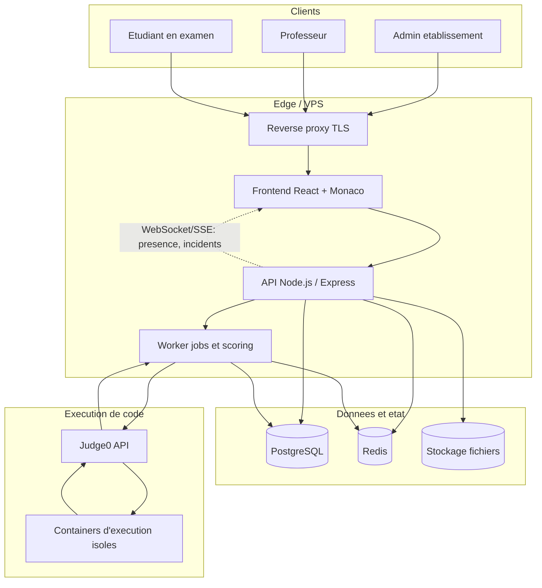

# Cylentic - Architecture globale

## 1. Vision produit

Cylentic est une plateforme SaaS multi-etablissements qui permet a des ecoles
d'organiser des examens de programmation dans le navigateur, avec execution de
code isolee, journalisation anti-triche et correction automatique.

Le MVP doit etre utile des maintenant pour un etablissement pilote :

- gestion d'un etablissement, de ses admins, professeurs, etudiants, classes et
  annees academiques ;
- creation et publication d'examens Python avec exercices de code et tests ;
- connexion et composition etudiant avec code d'examen, plein ecran, timer,
  sauvegarde automatique et soumission ;
- execution du code via Judge0 auto-heberge ;
- resultats professeur : copies, tests, score automatique, ajustement manuel,
  incidents et presence numerique ;
- socle de donnees pret pour QCM, multi-langages, exports, billing reel et
  integrations futures.

## 2. Architecture systeme generale

### Composants principaux

| Couche | Responsabilites | Technologie cible MVP |
| --- | --- | --- |
| Frontend web | Espaces admin/prof/etudiant, IDE, timer, anti-triche navigateur | React, TypeScript, Monaco Editor |
| API backend | Auth, tenants, examens, participations, corrections, audit | Node.js, Express, TypeScript |
| Worker asynchrone | Execution des tests, scoring, emails, exports futurs | Node.js worker + Redis/BullMQ |
| Base de donnees | Donnees transactionnelles, historique, audit | PostgreSQL |
| Cache/session/temps reel | Sessions actives, timers, presence live, queue MVP | Redis |
| Sandbox code | Execution isolee, limites CPU/RAM/temps, pas de reseau | Judge0 CE dans Docker |
| Stockage fichiers | Imports CSV, exports et artefacts futurs | Volume local MVP, S3 compatible ensuite |
| Reverse proxy | TLS, routage web/API, compression, headers securite | Nginx ou Caddy |

### Principes d'architecture

1. **Multi-tenant des le depart** : toutes les donnees metier sont rattachees a
   `institution_id`.
2. **Backend comme source de verite** : le timer, l'etat de participation,
   `is_completed`, les scores et incidents sont arbitres cote serveur.
3. **Frontend defensif, backend autoritaire** : les protections navigateur
   reduisent la triche, mais les decisions critiques sont validees par l'API.
4. **Execution isolee** : aucun code etudiant n'est execute dans l'API ; tout
   passe par Judge0.
5. **Trails d'audit** : actions admin, incidents, imports, tentatives de code et
   corrections sont conserves.
6. **Extensibilite controlee** : QCM, multi-langages, billing reel et exports
   s'ajoutent sans casser le modele principal.

## 3. Diagramme d'architecture generale



## 4. Flux fonctionnels MVP

### 4.1 Creation et administration d'un etablissement

1. Un admin cree l'etablissement et choisit un plan.
2. La plateforme cree l'admin initial, l'annee academique et le plan en mode
   simulation de paiement.
3. L'admin cree les classes, importe les etudiants et ajoute les professeurs.
4. Les identifiants sont generes par role :
   - `ADM-[SIGLE]-0001`
   - `PROF-[SIGLE]-0001`
   - `ETU-[SIGLE]-2026-0001`

### 4.2 Creation et publication d'un examen

1. Le professeur cree un examen en brouillon.
2. Il ajoute les classes autorisees, les exercices Python, les tests et les
   parametres de securite.
3. A la publication, l'API genere un code `XXXX-XXXX` unique.
4. Apres l'heure de debut, l'examen est verrouille et les modifications de
   contenu sont interdites.

### 4.3 Composition etudiant

1. L'etudiant saisit identifiant, mot de passe et code examen.
2. L'API valide le compte, la classe autorisee, le code, le delai d'acces et
   `is_completed = false`.
3. Le frontend force le plein ecran puis place l'etudiant en salle d'attente.
4. Pendant l'examen, le code est sauvegarde toutes les 30 secondes localement et
   cote serveur.
5. Les incidents navigateur sont envoyes a l'API et journalises.
6. La soumission manuelle, l'expiration du timer ou une exclusion definit
   `is_completed = true`.

### 4.4 Execution et correction

1. Le bouton "Executer" cree une execution non notee via Judge0.
2. La soumission finale cree des jobs de correction pour chaque exercice.
3. Le worker execute les tests, enregistre les sorties et calcule le score
   automatique.
4. Le professeur peut ajuster la note et ajouter un commentaire manuel.

## 5. Frontend

### Zones applicatives

- `/login` : authentification prof/admin, etudiant avec code examen.
- `/admin` : etablissement, classes, utilisateurs, imports, statistiques.
- `/teacher` : examens, edition, publication, supervision, resultats.
- `/exam/:participationId` : consignes, salle d'attente, IDE, soumission.
- `/exam/submitted` : confirmation de depot.

### Composants critiques

- `SecureExamShell` : plein ecran, Page Visibility API, raccourcis, clic droit.
- `ExamTimer` : affiche le temps restant recu du backend/Redis.
- `MonacoCodeEditor` : edition Python MVP, copy/paste interne.
- `AutosaveManager` : sauvegarde locale et serveur.
- `IncidentReporter` : buffer local puis envoi API pour tolerer les coupures.

## 6. Backend API

### Modules metier

- `auth` : login, JWT, changement de mot de passe, deduction du role.
- `institutions` : etablissement, plans, limites, admins.
- `users` : professeurs, etudiants, statuts, reset password.
- `classes` : classes, annees academiques, promotions.
- `exams` : brouillons, publication, codes, verrouillage.
- `participations` : presence, statut, `is_completed`, soumissions.
- `grading` : executions, tests, scores, corrections manuelles.
- `security` : incidents, politique anti-triche.
- `imports` : CSV et rapports d'erreurs.
- `audit` : journal admin et evenements critiques.

### API REST indicative

| Methode | Route | Usage |
| --- | --- | --- |
| `POST` | `/api/auth/login` | Connexion admin/prof |
| `POST` | `/api/auth/exam-login` | Connexion etudiant avec code |
| `POST` | `/api/institutions` | Creation espace etablissement |
| `POST` | `/api/admin/students/import` | Import CSV etudiants |
| `POST` | `/api/exams` | Creation examen |
| `POST` | `/api/exams/:id/publish` | Generation code et publication |
| `POST` | `/api/participations/:id/autosaves` | Sauvegarde code |
| `POST` | `/api/participations/:id/incidents` | Journal incident |
| `POST` | `/api/participations/:id/run` | Execution non notee |
| `POST` | `/api/participations/:id/submit` | Soumission finale |
| `GET` | `/api/exams/:id/results` | Resultats prof |

## 7. Donnees et stockage

- PostgreSQL conserve toutes les donnees critiques et historiques.
- Redis conserve les sessions actives, timers et files de jobs.
- Les imports CSV originaux et exports futurs vont dans un stockage objet.
- `db.md` documente le modele relationnel.
- `db.sql` cree la base PostgreSQL complete du MVP extensible.

## 8. Securite et conformite

- Mots de passe hashes avec Argon2id ou bcrypt fort.
- JWT courts + refresh token httpOnly en production.
- Isolation Judge0 sans reseau avec limites strictes.
- Rate limiting sur login, codes examen et execution de code.
- Journalisation des actions admin et incidents etudiants.
- Acces par role et par tenant a chaque requete.
- Sauvegarde reguliere PostgreSQL + restauration testee.
- TLS obligatoire via reverse proxy.

## 9. Deploiement MVP

### Environnements

- `local` : Docker Compose avec frontend, API, worker, PostgreSQL, Redis,
  Judge0 et reverse proxy optionnel.
- `staging` : miroir du VPS de production avec donnees anonymisees.
- `production` : VPS Docker Compose, volumes sauvegardes, monitoring basique.

### Services Docker cibles

- `web`
- `api`
- `worker`
- `postgres`
- `redis`
- `judge0-server`
- `judge0-worker`
- `reverse-proxy`

## 10. Structure des fichiers et dossiers cible

```text
cylentic/
|-- apps/
|   |-- web/
|   |   |-- src/
|   |   |   |-- app/
|   |   |   |-- components/
|   |   |   |-- features/
|   |   |   |   |-- admin/
|   |   |   |   |-- auth/
|   |   |   |   |-- exam-room/
|   |   |   |   `-- teacher/
|   |   |   |-- lib/
|   |   |   `-- styles/
|   |   `-- package.json
|   `-- api/
|       |-- src/
|       |   |-- config/
|       |   |-- modules/
|       |   |   |-- audit/
|       |   |   |-- auth/
|       |   |   |-- classes/
|       |   |   |-- exams/
|       |   |   |-- grading/
|       |   |   |-- imports/
|       |   |   |-- institutions/
|       |   |   |-- participations/
|       |   |   |-- security/
|       |   |   `-- users/
|       |   |-- workers/
|       |   `-- server.ts
|       `-- package.json
|-- packages/
|   |-- shared/
|   |   `-- src/
|   `-- ui/
|       `-- src/
|-- database/
|   |-- migrations/
|   `-- seeds/
|-- infra/
|   |-- docker/
|   |-- nginx/
|   `-- judge0/
|-- docs/
|   `-- decisions/
|-- ARCHITECTURE.md
|-- db.md
|-- db.sql
|-- docker-compose.yml
`-- README.md
```

Le depot actuel contient les livrables d'architecture et de base de donnees. La
structure ci-dessus est la cible recommandee pour l'implementation applicative.

## 11. Roadmap technique extensible

### MVP

- Authentification rolee.
- Gestion etablissement/classes/utilisateurs.
- Examens Python avec tests.
- Composition securisee dans navigateur.
- Judge0 pour executions.
- Resultats et corrections manuelles.

### Phase 1

- Java, C et C++.
- QCM complet avec melange des questions/reponses.
- Exports PDF/Excel.
- QR code d'acces examen.
- Vue live du code etudiant.

### Phase 2

- Paiement reel et facturation.
- Onboarding guide.
- Monitoring avance et alertes.

### Phase 3

- API publique.
- Integrations LMS.
- Application mobile ou interface surveillant.
