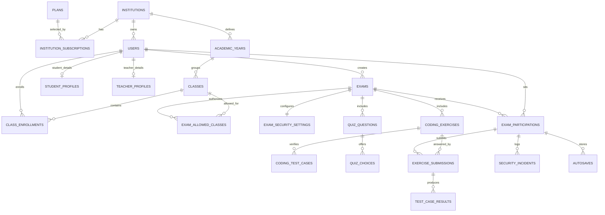

# Cylentic - Schema de base de donnees

Ce document decrit le modele PostgreSQL de Cylentic pour un MVP exploitable en
production pilote et extensible vers QCM, multi-langages, exports, billing reel
et integrations.

## 1. Conventions

- Base cible : PostgreSQL.
- Cle primaire : UUID genere par `gen_random_uuid()`.
- Multi-tenant : les tables metier portent `institution_id` quand elles sont
  rattachees a un etablissement.
- Horodatage : `created_at` et `updated_at` en `TIMESTAMPTZ`.
- Suppression : les comptes et donnees historiques sont desactives ou archives,
  jamais supprimes physiquement dans les flux normaux.
- Identifiant fonctionnel : `users.public_identifier`, unique globalement et
  lisible par l'utilisateur.
- Role deduit : le backend deduit le role depuis le prefixe de
  `public_identifier`, mais la colonne `users.role` sert aux contraintes et
  requetes.

## 2. Enumerations

| Enum | Valeurs | Usage |
| --- | --- | --- |
| `institution_type` | `public_university`, `private_university`, `engineering_school`, `bts`, `technical_high_school`, `other` | Type d'etablissement |
| `user_role` | `institution_admin`, `teacher`, `student` | Role applicatif |
| `user_status` | `pending_activation`, `active`, `disabled` | Cycle de vie compte |
| `subscription_status` | `trialing`, `active`, `past_due`, `cancelled`, `expired` | Etat abonnement |
| `exam_status` | `draft`, `published`, `in_progress`, `completed`, `archived` | Cycle de vie examen |
| `exam_content_type` | `coding`, `quiz`, `mixed` | Nature de l'examen |
| `grading_mode` | `automatic`, `manual` | Correction |
| `programming_language` | `python`, `java`, `c`, `cpp` | Langage cible |
| `participation_status` | `not_started`, `waiting_room`, `in_progress`, `submitted`, `auto_submitted`, `expelled`, `absent` | Etat etudiant |
| `incident_type` | `fullscreen_exit`, `tab_switch`, `clipboard_paste`, `shortcut_blocked`, `right_click`, `network_loss`, `session_close`, `manual_report` | Anti-triche |
| `run_status` | `queued`, `running`, `accepted`, `wrong_answer`, `runtime_error`, `time_limit_exceeded`, `compilation_error`, `internal_error` | Execution code |
| `question_type` | `single_choice`, `multiple_choice` | QCM |
| `import_status` | `pending`, `processing`, `completed`, `completed_with_errors`, `failed` | Import CSV |
| `audit_actor_type` | `system`, `institution_admin`, `teacher` | Journal d'activite |

## 3. Tables de reference et billing

### 3.1 `plans`

Catalogue des plans commerciaux.

| Colonne | Type | Contraintes | Description |
| --- | --- | --- | --- |
| `id` | UUID | PK | Identifiant plan |
| `code` | TEXT | UNIQUE, NOT NULL | `free`, `starter`, `pro`, `enterprise` |
| `name` | TEXT | NOT NULL | Nom commercial |
| `monthly_price_cfa` | INTEGER | NULL | Prix mensuel indicatif |
| `max_teachers` | INTEGER | NULL | NULL = illimite |
| `max_students` | INTEGER | NULL | NULL = illimite |
| `max_exams_per_month` | INTEGER | NULL | NULL = illimite |
| `has_reports` | BOOLEAN | NOT NULL | Rapports avances |
| `has_priority_support` | BOOLEAN | NOT NULL | Support prioritaire |
| `created_at` | TIMESTAMPTZ | NOT NULL | Creation |
| `updated_at` | TIMESTAMPTZ | NOT NULL | Modification |

Cardinalite : un plan peut etre utilise par plusieurs abonnements.

### 3.2 `institutions`

Etablissements clients.

| Colonne | Type | Contraintes | Description |
| --- | --- | --- | --- |
| `id` | UUID | PK | Identifiant etablissement |
| `official_name` | TEXT | NOT NULL | Nom officiel |
| `slug` | TEXT | UNIQUE, NOT NULL | Slug technique |
| `short_code` | TEXT | UNIQUE, NOT NULL | Sigle utilise dans les identifiants |
| `type` | `institution_type` | NOT NULL | Type |
| `country` | TEXT | NOT NULL | Pays |
| `city` | TEXT | NOT NULL | Ville |
| `timezone` | TEXT | NOT NULL | Fuseau horaire |
| `official_email` | CITEXT | NOT NULL | Email officiel |
| `phone_number` | TEXT | NOT NULL | Contact |
| `status` | TEXT | NOT NULL | `active`, `suspended`, `archived` |
| `created_at` | TIMESTAMPTZ | NOT NULL | Creation |
| `updated_at` | TIMESTAMPTZ | NOT NULL | Modification |

Cardinalite : un etablissement possede 0..N utilisateurs, classes, examens,
annees academiques et abonnements.

### 3.3 `institution_subscriptions`

Historique d'abonnements par etablissement.

| Colonne | Type | Contraintes | Description |
| --- | --- | --- | --- |
| `id` | UUID | PK | Identifiant |
| `institution_id` | UUID | FK institutions, NOT NULL | Etablissement |
| `plan_id` | UUID | FK plans, NOT NULL | Plan |
| `status` | `subscription_status` | NOT NULL | Etat |
| `trial_starts_at` | TIMESTAMPTZ | NULL | Debut essai |
| `trial_ends_at` | TIMESTAMPTZ | NULL | Fin essai |
| `current_period_starts_at` | TIMESTAMPTZ | NOT NULL | Debut periode |
| `current_period_ends_at` | TIMESTAMPTZ | NOT NULL | Fin periode |
| `payment_provider` | TEXT | NULL | Fournisseur futur |
| `provider_customer_id` | TEXT | NULL | ID fournisseur |
| `created_at` | TIMESTAMPTZ | NOT NULL | Creation |
| `updated_at` | TIMESTAMPTZ | NOT NULL | Modification |

Cardinalite : un etablissement a 0..N abonnements, un seul actif attendu cote
application.

## 4. Utilisateurs, classes et referentiels academiques

### 4.1 `academic_years`

Annees academiques d'un etablissement.

| Colonne | Type | Contraintes | Description |
| --- | --- | --- | --- |
| `id` | UUID | PK | Identifiant |
| `institution_id` | UUID | FK institutions, NOT NULL | Etablissement |
| `label` | TEXT | NOT NULL | Ex: `2025-2026` |
| `starts_on` | DATE | NOT NULL | Debut |
| `ends_on` | DATE | NOT NULL | Fin |
| `is_current` | BOOLEAN | NOT NULL | Annee active |
| `archived_at` | TIMESTAMPTZ | NULL | Archivage |
| `created_at` | TIMESTAMPTZ | NOT NULL | Creation |
| `updated_at` | TIMESTAMPTZ | NOT NULL | Modification |

Contraintes : `label` unique par etablissement, `ends_on > starts_on`.

### 4.2 `classes`

Classes/promotions.

| Colonne | Type | Contraintes | Description |
| --- | --- | --- | --- |
| `id` | UUID | PK | Identifiant |
| `institution_id` | UUID | FK institutions, NOT NULL | Etablissement |
| `academic_year_id` | UUID | FK academic_years, NOT NULL | Annee |
| `name` | TEXT | NOT NULL | Ex: L2 INFO |
| `track` | TEXT | NOT NULL | Filiere |
| `level` | TEXT | NOT NULL | Niveau |
| `is_archived` | BOOLEAN | NOT NULL | Archivee |
| `created_at` | TIMESTAMPTZ | NOT NULL | Creation |
| `updated_at` | TIMESTAMPTZ | NOT NULL | Modification |

Cardinalite : une classe contient 0..N inscriptions et peut etre autorisee a
0..N examens.

### 4.3 `users`

Table centrale des comptes.

| Colonne | Type | Contraintes | Description |
| --- | --- | --- | --- |
| `id` | UUID | PK | Identifiant |
| `institution_id` | UUID | FK institutions, NOT NULL | Etablissement |
| `public_identifier` | TEXT | UNIQUE, NOT NULL | Identifiant saisi a la connexion |
| `role` | `user_role` | NOT NULL | Role |
| `status` | `user_status` | NOT NULL | Etat compte |
| `first_name` | TEXT | NOT NULL | Prenom |
| `last_name` | TEXT | NOT NULL | Nom |
| `email` | CITEXT | NOT NULL | Email |
| `password_hash` | TEXT | NOT NULL | Hash mot de passe |
| `must_change_password` | BOOLEAN | NOT NULL | Mot de passe par defaut a changer |
| `last_login_at` | TIMESTAMPTZ | NULL | Derniere connexion |
| `activated_at` | TIMESTAMPTZ | NULL | Activation |
| `disabled_at` | TIMESTAMPTZ | NULL | Desactivation |
| `created_at` | TIMESTAMPTZ | NOT NULL | Creation |
| `updated_at` | TIMESTAMPTZ | NOT NULL | Modification |

Contraintes :

- email unique par etablissement ;
- le prefixe de `public_identifier` doit correspondre au role ;
- un trigger limite a 2 admins actifs par etablissement.

### 4.4 `student_profiles`

Informations propres aux etudiants.

| Colonne | Type | Contraintes | Description |
| --- | --- | --- | --- |
| `user_id` | UUID | PK, FK users | Compte etudiant |
| `institution_id` | UUID | FK institutions, NOT NULL | Etablissement |
| `student_number` | TEXT | NOT NULL | Matricule / INE |
| `created_at` | TIMESTAMPTZ | NOT NULL | Creation |
| `updated_at` | TIMESTAMPTZ | NOT NULL | Modification |

Cardinalite : un utilisateur etudiant a exactement 0..1 profil etudiant.

### 4.5 `teacher_profiles`

Informations propres aux professeurs.

| Colonne | Type | Contraintes | Description |
| --- | --- | --- | --- |
| `user_id` | UUID | PK, FK users | Compte professeur |
| `institution_id` | UUID | FK institutions, NOT NULL | Etablissement |
| `position_title` | TEXT | NULL | Fonction |
| `subjects` | TEXT[] | NOT NULL | Matieres enseignees |
| `created_at` | TIMESTAMPTZ | NOT NULL | Creation |
| `updated_at` | TIMESTAMPTZ | NOT NULL | Modification |

### 4.6 `class_enrollments`

Inscription des etudiants dans les classes par annee academique.

| Colonne | Type | Contraintes | Description |
| --- | --- | --- | --- |
| `id` | UUID | PK | Identifiant |
| `institution_id` | UUID | FK institutions, NOT NULL | Etablissement |
| `student_user_id` | UUID | FK users, NOT NULL | Etudiant |
| `class_id` | UUID | FK classes, NOT NULL | Classe |
| `academic_year_id` | UUID | FK academic_years, NOT NULL | Annee |
| `enrolled_at` | TIMESTAMPTZ | NOT NULL | Date inscription |
| `left_at` | TIMESTAMPTZ | NULL | Sortie |
| `created_at` | TIMESTAMPTZ | NOT NULL | Creation |
| `updated_at` | TIMESTAMPTZ | NOT NULL | Modification |

Cardinalite : un etudiant a 0..N inscriptions historiques, au plus une active
par annee dans le MVP.

## 5. Examens et contenu pedagogique

### 5.1 `exams`

Conteneur principal d'un examen.

| Colonne | Type | Contraintes | Description |
| --- | --- | --- | --- |
| `id` | UUID | PK | Identifiant |
| `institution_id` | UUID | FK institutions, NOT NULL | Etablissement |
| `teacher_user_id` | UUID | FK users, NOT NULL | Createur |
| `title` | TEXT | NOT NULL | Nom examen |
| `description` | TEXT | NULL | Notes internes |
| `status` | `exam_status` | NOT NULL | Etat |
| `content_type` | `exam_content_type` | NOT NULL | Code/QCM/mixte |
| `default_grading_mode` | `grading_mode` | NOT NULL | Correction par defaut |
| `starts_at` | TIMESTAMPTZ | NOT NULL | Debut officiel |
| `duration_minutes` | INTEGER | NOT NULL | Duree |
| `access_window_minutes` | INTEGER | NOT NULL | Retardataires |
| `access_code` | TEXT | UNIQUE, NULL | Code `XXXX-XXXX` |
| `published_at` | TIMESTAMPTZ | NULL | Publication |
| `locked_at` | TIMESTAMPTZ | NULL | Verrouillage |
| `completed_at` | TIMESTAMPTZ | NULL | Fin |
| `created_at` | TIMESTAMPTZ | NOT NULL | Creation |
| `updated_at` | TIMESTAMPTZ | NOT NULL | Modification |

Cardinalite : un professeur cree 0..N examens ; un examen a 1..N classes
autorisees, 0..N exercices, 0..N questions QCM et 0..N participations.

### 5.2 `exam_allowed_classes`

Association examens/classes autorisees.

| Colonne | Type | Contraintes | Description |
| --- | --- | --- | --- |
| `exam_id` | UUID | PK composite, FK exams | Examen |
| `class_id` | UUID | PK composite, FK classes | Classe |
| `created_at` | TIMESTAMPTZ | NOT NULL | Creation |

Cardinalite : N..N entre examens et classes.

### 5.3 `exam_security_settings`

Parametres anti-triche par examen.

| Colonne | Type | Contraintes | Description |
| --- | --- | --- | --- |
| `exam_id` | UUID | PK, FK exams | Examen |
| `force_fullscreen` | BOOLEAN | NOT NULL | Plein ecran |
| `block_external_clipboard` | BOOLEAN | NOT NULL | Presse-papier externe |
| `block_browser_shortcuts` | BOOLEAN | NOT NULL | Raccourcis |
| `max_incidents_before_expulsion` | INTEGER | NOT NULL | Seuil exclusion |
| `autosave_interval_seconds` | INTEGER | NOT NULL | Intervalle autosave |
| `created_at` | TIMESTAMPTZ | NOT NULL | Creation |
| `updated_at` | TIMESTAMPTZ | NOT NULL | Modification |

### 5.4 `coding_exercises`

Exercices de programmation.

| Colonne | Type | Contraintes | Description |
| --- | --- | --- | --- |
| `id` | UUID | PK | Identifiant |
| `exam_id` | UUID | FK exams, NOT NULL | Examen |
| `institution_id` | UUID | FK institutions, NOT NULL | Etablissement |
| `position` | INTEGER | NOT NULL | Ordre |
| `title` | TEXT | NOT NULL | Titre |
| `statement_md` | TEXT | NOT NULL | Enonce Markdown |
| `language` | `programming_language` | NOT NULL | Python MVP |
| `points` | NUMERIC(7,2) | NOT NULL | Points |
| `grading_mode` | `grading_mode` | NOT NULL | Auto/manuel |
| `starter_code` | TEXT | NOT NULL | Code initial |
| `created_at` | TIMESTAMPTZ | NOT NULL | Creation |
| `updated_at` | TIMESTAMPTZ | NOT NULL | Modification |

### 5.5 `coding_test_cases`

Tests unitaires d'un exercice.

| Colonne | Type | Contraintes | Description |
| --- | --- | --- | --- |
| `id` | UUID | PK | Identifiant |
| `exercise_id` | UUID | FK coding_exercises, NOT NULL | Exercice |
| `position` | INTEGER | NOT NULL | Ordre |
| `input_payload` | TEXT | NOT NULL | Entree ou code d'appel |
| `expected_output` | TEXT | NOT NULL | Sortie attendue |
| `is_hidden` | BOOLEAN | NOT NULL | Cache a l'etudiant |
| `weight` | NUMERIC(7,2) | NOT NULL | Ponderation |
| `timeout_ms` | INTEGER | NOT NULL | Limite temps |
| `memory_kb` | INTEGER | NOT NULL | Limite memoire |
| `created_at` | TIMESTAMPTZ | NOT NULL | Creation |
| `updated_at` | TIMESTAMPTZ | NOT NULL | Modification |

### 5.6 Tables QCM extensibles

`quiz_questions` et `quiz_choices` sont presentes des le MVP pour eviter une
migration lourde en Phase 1, meme si l'interface QCM peut rester limitee.

Relations :

- `exams` 1..N `quiz_questions`
- `quiz_questions` 2..N `quiz_choices`

## 6. Composition, soumissions et correction

### 6.1 `exam_participations`

Participation d'un etudiant a un examen.

| Colonne | Type | Contraintes | Description |
| --- | --- | --- | --- |
| `id` | UUID | PK | Identifiant |
| `institution_id` | UUID | FK institutions, NOT NULL | Etablissement |
| `exam_id` | UUID | FK exams, NOT NULL | Examen |
| `student_user_id` | UUID | FK users, NOT NULL | Etudiant |
| `status` | `participation_status` | NOT NULL | Etat |
| `is_completed` | BOOLEAN | NOT NULL | Protection double soumission |
| `first_login_at` | TIMESTAMPTZ | NULL | Presence numerique |
| `waiting_room_entered_at` | TIMESTAMPTZ | NULL | Salle attente |
| `started_at` | TIMESTAMPTZ | NULL | Debut composition |
| `submitted_at` | TIMESTAMPTZ | NULL | Soumission |
| `last_seen_at` | TIMESTAMPTZ | NULL | Presence live |
| `login_ip` | INET | NULL | IP connexion |
| `user_agent` | TEXT | NULL | Navigateur |
| `final_score` | NUMERIC(7,2) | NULL | Note finale |
| `created_at` | TIMESTAMPTZ | NOT NULL | Creation |
| `updated_at` | TIMESTAMPTZ | NOT NULL | Modification |

Contraintes : unique `(exam_id, student_user_id)`.

### 6.2 `exercise_submissions`

Copie par exercice.

| Colonne | Type | Contraintes | Description |
| --- | --- | --- | --- |
| `id` | UUID | PK | Identifiant |
| `participation_id` | UUID | FK exam_participations, NOT NULL | Participation |
| `exercise_id` | UUID | FK coding_exercises, NOT NULL | Exercice |
| `source_code` | TEXT | NOT NULL | Code soumis |
| `submitted_at` | TIMESTAMPTZ | NULL | Date soumission |
| `run_status` | `run_status` | NOT NULL | Etat correction |
| `automatic_score` | NUMERIC(7,2) | NULL | Score auto |
| `manual_score` | NUMERIC(7,2) | NULL | Score manuel |
| `teacher_comment` | TEXT | NULL | Commentaire |
| `graded_by_user_id` | UUID | FK users, NULL | Correcteur |
| `graded_at` | TIMESTAMPTZ | NULL | Date correction |
| `created_at` | TIMESTAMPTZ | NOT NULL | Creation |
| `updated_at` | TIMESTAMPTZ | NOT NULL | Modification |

Contraintes : unique `(participation_id, exercise_id)`.

### 6.3 `test_case_results`

Resultats detailles des tests.

| Colonne | Type | Contraintes | Description |
| --- | --- | --- | --- |
| `id` | UUID | PK | Identifiant |
| `exercise_submission_id` | UUID | FK exercise_submissions, NOT NULL | Soumission |
| `test_case_id` | UUID | FK coding_test_cases, NOT NULL | Test |
| `run_status` | `run_status` | NOT NULL | Etat |
| `actual_output` | TEXT | NULL | Sortie obtenue |
| `stderr_output` | TEXT | NULL | Erreur |
| `execution_time_ms` | INTEGER | NULL | Temps |
| `memory_kb` | INTEGER | NULL | Memoire |
| `passed` | BOOLEAN | NOT NULL | Test reussi |
| `judge0_token` | TEXT | NULL | Trace Judge0 |
| `created_at` | TIMESTAMPTZ | NOT NULL | Creation |

### 6.4 `code_run_requests`

Historique du bouton "Executer" pendant l'examen.

| Colonne | Type | Contraintes | Description |
| --- | --- | --- | --- |
| `id` | UUID | PK | Identifiant |
| `participation_id` | UUID | FK exam_participations, NOT NULL | Participation |
| `exercise_id` | UUID | FK coding_exercises, NOT NULL | Exercice |
| `source_code` | TEXT | NOT NULL | Code execute |
| `run_status` | `run_status` | NOT NULL | Etat |
| `stdout_output` | TEXT | NULL | Sortie |
| `stderr_output` | TEXT | NULL | Erreur |
| `execution_time_ms` | INTEGER | NULL | Temps |
| `memory_kb` | INTEGER | NULL | Memoire |
| `judge0_token` | TEXT | NULL | Trace Judge0 |
| `created_at` | TIMESTAMPTZ | NOT NULL | Creation |
| `updated_at` | TIMESTAMPTZ | NOT NULL | Modification |

### 6.5 `autosaves`

Sauvegardes periodiques du code.

| Colonne | Type | Contraintes | Description |
| --- | --- | --- | --- |
| `id` | UUID | PK | Identifiant |
| `participation_id` | UUID | FK exam_participations, NOT NULL | Participation |
| `exercise_id` | UUID | FK coding_exercises, NOT NULL | Exercice |
| `source_code` | TEXT | NOT NULL | Code sauvegarde |
| `client_saved_at` | TIMESTAMPTZ | NULL | Date navigateur |
| `created_at` | TIMESTAMPTZ | NOT NULL | Date serveur |

Retention recommandee : garder tous les autosaves pendant l'examen, puis ne
conserver que le dernier par exercice apres archivage long terme si le volume
devient important.

## 7. Anti-triche, audit et imports

### 7.1 `security_incidents`

Journal d'incidents etudiants.

| Colonne | Type | Contraintes | Description |
| --- | --- | --- | --- |
| `id` | UUID | PK | Identifiant |
| `participation_id` | UUID | FK exam_participations, NOT NULL | Participation |
| `incident_type` | `incident_type` | NOT NULL | Type |
| `occurred_at` | TIMESTAMPTZ | NOT NULL | Date cote client |
| `received_at` | TIMESTAMPTZ | NOT NULL | Date serveur |
| `duration_ms` | INTEGER | NULL | Duree |
| `payload` | JSONB | NOT NULL | Details |
| `created_at` | TIMESTAMPTZ | NOT NULL | Creation |

### 7.2 `exam_access_attempts`

Tentatives de saisie du code examen.

| Colonne | Type | Contraintes | Description |
| --- | --- | --- | --- |
| `id` | UUID | PK | Identifiant |
| `institution_id` | UUID | FK institutions, NULL | Etablissement si connu |
| `public_identifier` | TEXT | NOT NULL | Identifiant saisi |
| `access_code` | TEXT | NOT NULL | Code saisi |
| `success` | BOOLEAN | NOT NULL | Succes |
| `failure_reason` | TEXT | NULL | Raison |
| `ip_address` | INET | NULL | IP |
| `user_agent` | TEXT | NULL | Navigateur |
| `created_at` | TIMESTAMPTZ | NOT NULL | Date |

### 7.3 `import_batches` et `import_batch_errors`

Tracent les imports CSV et leurs erreurs ligne par ligne.

Cardinalite : un import a 0..N erreurs.

### 7.4 `admin_audit_logs`

Journal d'activite admin et evenements systeme.

| Colonne | Type | Contraintes | Description |
| --- | --- | --- | --- |
| `id` | UUID | PK | Identifiant |
| `institution_id` | UUID | FK institutions, NOT NULL | Etablissement |
| `actor_type` | `audit_actor_type` | NOT NULL | Type acteur |
| `actor_user_id` | UUID | FK users, NULL | Acteur utilisateur |
| `action` | TEXT | NOT NULL | Action |
| `entity_type` | TEXT | NOT NULL | Type entite |
| `entity_id` | UUID | NULL | ID entite |
| `metadata` | JSONB | NOT NULL | Details |
| `ip_address` | INET | NULL | IP |
| `created_at` | TIMESTAMPTZ | NOT NULL | Date |

### 7.5 `notification_logs`

Historique des emails et notifications critiques.

## 8. Relations et cardinalites principales

| Relation | Cardinalite | Regle |
| --- | --- | --- |
| Institution -> Users | 1 -> 0..N | Chaque utilisateur appartient a un etablissement |
| Institution -> Admins actifs | 1 -> 1..2 | Maximum deux admins actifs par etablissement |
| AcademicYear -> Classes | 1 -> 0..N | Une classe appartient a une annee |
| Student -> ClassEnrollments | 1 -> 0..N | Historique des promotions |
| Teacher -> Exams | 1 -> 0..N | Un examen a un createur professeur |
| Exam -> AllowedClasses | 1 -> 1..N | Au moins une classe avant publication |
| Exam -> CodingExercises | 1 -> 0..N | MVP code : au moins un exercice avant publication |
| CodingExercise -> TestCases | 1 -> 0..N | Obligatoire si correction automatique |
| Exam -> Participations | 1 -> 0..N | Une par etudiant |
| Participation -> ExerciseSubmissions | 1 -> 0..N | Une copie par exercice |
| ExerciseSubmission -> TestCaseResults | 1 -> 0..N | Un resultat par test execute |
| Participation -> SecurityIncidents | 1 -> 0..N | Chronologie anti-triche |

## 9. Index et contraintes critiques

- `users(public_identifier)` unique pour login rapide.
- `users(institution_id, email)` unique pour eviter doublons.
- `exams(access_code)` unique quand non NULL.
- `exam_participations(exam_id, student_user_id)` unique pour bloquer double
  participation.
- `exercise_submissions(participation_id, exercise_id)` unique pour une copie
  finale par exercice.
- Index temporels sur incidents, autosaves et attempts pour supervision.
- Contraintes CHECK sur points, durees, ponderations et formats de codes.

## 10. Notes d'implementation

- La generation des identifiants fonctionnels doit etre faite dans le backend
  avec transaction et compteur par etablissement/role.
- La generation du code examen doit exclure `0`, `O`, `1`, `I`, `L`.
- La publication d'un examen doit verifier :
  - au moins une classe autorisee ;
  - contenu non vide ;
  - tests presents pour les exercices automatiques ;
  - code unique genere.
- Le verrouillage au demarrage peut etre gere par un job planifie ou par calcul
  a la lecture, puis persiste dans `locked_at`.
- Le score final peut etre recalcule a chaque correction ou materialise dans
  `exam_participations.final_score`.
